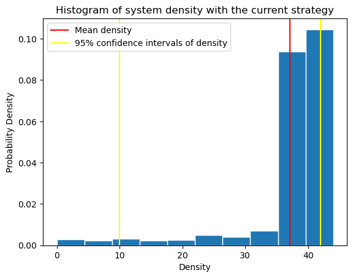
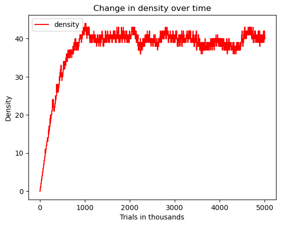
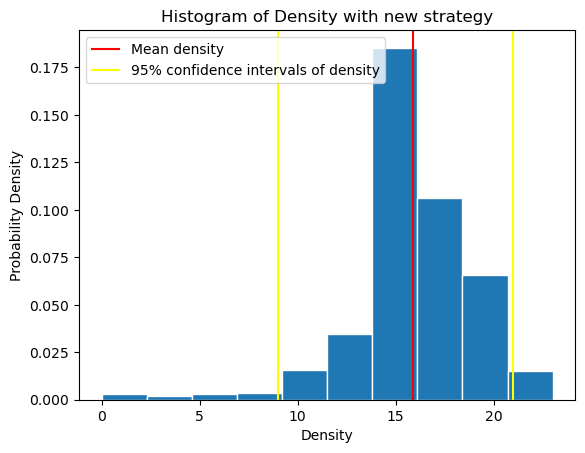
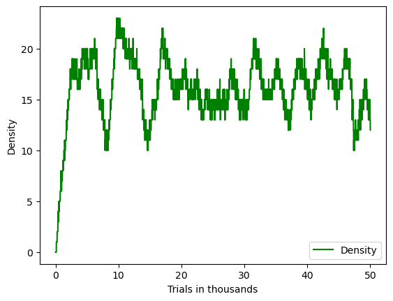
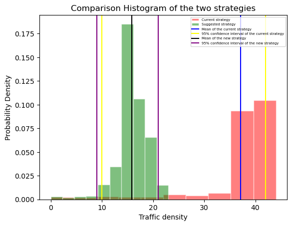
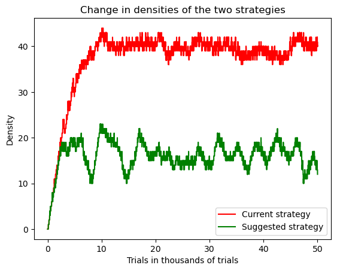

# Traffic Simulation

## Summary

This project addresses the problem of improving the traffic flow around Av. 9 de Julio in Buenos Aires, Argentina, which is one of the busiest intersections in the city. After running empirical trials that simulated the traffic flow for a long time, we see that introducing turn lanes
that don’t require waiting at the traffic signals would reduce the average traffic density by almost half, which is a considerable improvement on the current system. Based on these results, it is suggested that such rules be implemented at the intersection under consideration to improve traffic flow.

## Introduction

Given the number of people that use it daily, optimizing traffic flow in this part of the city can be seen as a big positive not just for the people but also from the political perspective would be seen as a great move. To study this intersection, we have relied on data collection, which we conducted in person to see how many vehicles pass by the corner around the evening to estimate the traffic flow rate. Then, we modeled this using computer simulation.  
We have modeled the traffic using the Intelligent Driver model. While the Nagel-Schreckenberg model (1992) is an interesting choice, the Intelligent Driver Model (IDM) was introduced in 2000 to improve traffic models and encompasses many other factors such as
driver reaction time, safe distance, etc. This model has also been recently adapted to be used in 3 Adaptive Cruise Control technology (Malinauskas, 2014) and has shown to be much more adaptive to different kinds of traffic simulations over the years, as demonstrated by Kurtc (2020), who used it to model bicycle traffic, and Kesting et al. (2010) who used it to model different kinds of drivers influencing traffic flow.

## Current Strategy

The intersection is composed of four traffic lights, working in pairs with cycles of 30 seconds. Right-hand turns are allowed on each traffic light as these lead to the districts that this junction connects. However, any car turning also has to wait at the traffic signal, slowing down
the ones behind. This slows down the system because a turning car is usually much slower than one going straight. Looking at the empirical results:

## Suggested Strategy

Our suggested strategy includes a lane that allows people to turn without waiting for the traffic light to go green. This system adds a bit of risk to the system in the sense that now drivers need to be more careful when turning so that they don’t turn at the same time as when one car is approaching from the straight. However, a good implementation of this would altogether remove the turning aspect from those going straight unless there is a big traffic jam. Model Performance:

## Comparison

We can compare the two models empirically as a theoretical comparison of these would require calculations as it includes a lot of variables and complex probabilistic equations. Thus, we will rely on our simulation results.

As we can see above, not only does the histogram of the new strategy lie completely to the left of the current one but it also stabilizes more quickly than the new strategy as shown in the evolution plots. It stabilizes around a much smaller value and this shows that the strategy is
better. Going into more detailed statistics, the mean of the current simulation is around 37 while the confidence interval is [10, 42]. In comparison, the mean of the new strategy simulation is around 16 with a confidence interval of [9, 21]. The intervals for the new strategy are also much narrower showing that there is lesser variance with more confidence in the stabilization as compared to the current strategy whose performance is much more unpredictable.

This comparison shows that the suggested strategy would reduce the average traffic density at the intersection by more than half which will improve traffic flow. Not only are the expected results much better, but we are also much more confident in our results for the new strategy due to the smaller confidence interval.

## Conclusion

Given the analysis above, we can conclude that introducing a lane that allows people to turn to the right to do so without waiting for a traffic light would reduce density by almost 20 cars per system on average which means that it is a much better system as compared to the current strategy which requires cars to wait in line regardless of if they are going straight or turning. Thus, we suggest that the city government think about implementing this strategy to improve the standard of living in the city.
